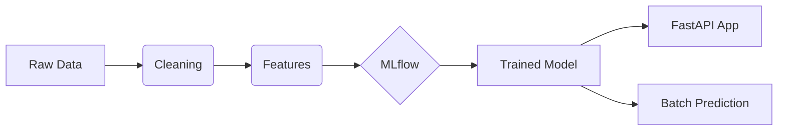

# 💳 Credit Risk Prediction Project

This project implements an end-to-end MLOps pipeline for predicting loan default risk. It transforms raw financial data into a production-ready, containerized API.

---

## � Quick Start

Ready to see it in action? Follow these three steps:

1. **Setup**: `pip install -r requirements.txt`
2. **Train**: `python src/train.py`
3. **Serve**: `uvicorn src.app:app --reload`
4. **Test**: Send a test request via [Live Prediction Example](#-live-prediction-example) below.

---

## 🛠 Project Lifecycle

### 🧱 Development Phase

Follow the interactive development process in the `notebooks/` directory.

#### 1. Data Cleaning & EDA

- **Process**: Removed outliers (Age > 90, Employment > 60) and imputed missing interest rates.
- **Artifacts**: [data_cleaning.py](src/data_cleaning.py) | [01_eda_analysis.ipynb](notebooks/01_eda_analysis.ipynb) | [02_data_cleaning.ipynb](notebooks/02_data_cleaning.ipynb)

#### 2. Feature Engineering

- **Process**: Applied One-Hot Encoding and Standard Scaling.
- **SOP**: The `preprocessor.joblib` is saved to ensure consistent transformations during production.
- **Artifacts**: [feature_engineering.py](src/feature_engineering.py) | [03_feature_engineering.ipynb](notebooks/03_feature_engineering.ipynb)

#### 3. Model Training & Registry

- **Algorithm**: Random Forest Classifier.
- **Tracking**: Integrated **MLflow** for hyperparameter and metric logging.
- **Artifacts**: [train.py](src/train.py) | [04_model_training.ipynb](notebooks/04_model_training.ipynb)

---

### 🚀 Operations & Deployment phase

#### 📊 Pipeline Architecture (Mermaid)



#### 4. Real-time Serving (FastAPI)

Wrap the model in a production-ready REST API for integration with downstream apps.

- **Artifacts**: [app.py](src/app.py) | [Dockerfile](Dockerfile)

#### 5. Batch Inference

Run bulk predictions on large datasets and generate performance reports.

- **Artifacts**: [batch_prediction.py](src/batch_prediction.py) | [05_batch_prediction.ipynb](notebooks/05_batch_prediction.ipynb)

---

## 🌐 Hosting & Deployment Documentation

### 1. Local Containerization (Docker)

```bash
docker build -t credit-risk-api .
docker run -p 8000:8000 credit-risk-api
```

### 2. Cloud Hosting Options

- **GCP Cloud Run** (Recommended): Serverless, cost-effective, and easy to manage.
- **AWS App Runner**: Direct deployment from GitHub for seamless CI/CD.

---

## 🧪 Live Prediction Example

Once hosted, you can perform live risk assessments using the `/predict` endpoint.

### cURL Example

```bash
curl -X 'POST' 'http://localhost:8000/predict' \
     -H 'Content-Type: application/json' \
     -d '{"person_age": 25, "person_income": 50000, "person_home_ownership": "RENT", "person_emp_length": 2, "loan_intent": "PERSONAL", "loan_grade": "A", "loan_amnt": 5000, "loan_int_rate": 7.5, "cb_person_default_on_file": "N", "cb_person_cred_hist_length": 3}'
```

---
*Maintained by Victor Wei - MLOps Portfolio*
